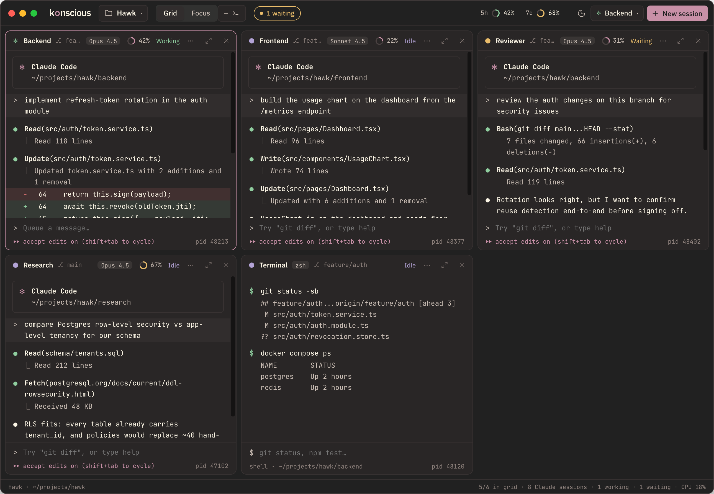

<p align="center">
  <picture>
    <source media="(prefers-color-scheme: dark)" srcset=".github/assets/hero-dark.svg">
    
  </picture>
</p>

<h3 align="center">Run Claude Code in six places at once.<br>Konscious shows you which one is waiting.</h3>

<p align="center">
  <a href="https://github.com/Karnav018/konscious/releases/download/v0.3.2/Konscious-0.3.2-universal.dmg"></a>
  <a href="https://github.com/Karnav018/konscious/releases/download/v0.3.2/Konscious_0.3.2_x64-setup.exe"></a>
  <a href="https://konscious.hawkapp.in"></a>
</p>

<p align="center">
  Free for macOS and Windows. Runs the Claude Code you already have.<br>
  <a href="https://konscious.hawkapp.in">konscious.hawkapp.in</a>
</p>

<br>

## Why it exists

Claude Code is good enough that you stop watching it. You start a second session while the first one works, then a third. Soon you're flicking through terminal tabs for the one that stopped to ask you something, and finding it ten minutes late.

Konscious puts up to six sessions in one window and watches every one of them. When a session needs you, its pane says so, the title bar counts it, and one shortcut takes you there.

## What it does

### Run them side by side

Six panes in a grid, or one in Focus. Drag a pane by its header to put it where you want it; hidden sessions keep running. Open a shell in the same folder as the session you're in, and switch between your two latest workspaces right from the title bar.

### See which one needs you

Each pane shows **Working**, **Waiting** or **Idle**, read from Claude Code's own hooks, so a session stuck on a permission prompt shows it the moment it stops. The title bar counts the ones waiting, and <kbd>⌘</kbd> <kbd>J</kbd> takes you to the next. A session that finished while you were elsewhere keeps a dot until you look at it.

### Come back to all of it

Quit whenever you like. Next time, every session that was running resumes its conversation in the same layout. New versions download in the background and wait for you to restart.

### And the small things

- Drag a file from Finder onto a pane, or copy it and press <kbd>⌘</kbd> <kbd>V</kbd>, and its path is typed in. Drop a screenshot on a Claude session and Claude sees the image.
- Rings in the title bar show your 5-hour and 7-day usage. Each pane shows its model and how full its context window is.
- Stop every session in a workspace at once from the workspace menu.
- Warm colours for late nights, in Konscious only. Status colours stay true at 1am.
- Your Claude Code setup stays yours: your settings, hooks and logins are never edited.

<p align="center">
  
</p>

## Install

Konscious runs your own Claude Code, so install it and sign in first.

| | macOS | Windows |
|---|---|---|
| **Download** | [Konscious-0.3.2-universal.dmg](https://github.com/Karnav018/konscious/releases/download/v0.3.2/Konscious-0.3.2-universal.dmg) | [Konscious_0.3.2_x64-setup.exe](https://github.com/Karnav018/konscious/releases/download/v0.3.2/Konscious_0.3.2_x64-setup.exe) |
| **Runs on** | macOS 13 or later, Apple silicon and Intel | Windows 10 or 11, 64-bit |
| **Install** | Open the DMG and drag Konscious to Applications | Run the installer. It installs for your account, no admin needed |
| **First launch** | The app isn't notarized yet, so macOS stops it once: open **System Settings › Privacy & Security** and click **Open Anyway** | If Windows says it protected your PC, click **More info**, then **Run anyway** |
| **Claude Code** | `curl -fsSL https://claude.ai/install.sh \| bash` | `irm https://claude.ai/install.ps1 \| iex` |

**Updates install themselves, when you say so.** Konscious checks for a new version shortly after launch and every hour, and downloads it in the background. It never restarts behind your back, because a restart stops every live session: the title bar shows **Restart to update** and waits. When it comes back, every session that was running resumes. Updates are checked against a signing key built into the app, so only releases from this repo can install themselves.

<details>
<summary><b>Keyboard shortcuts</b></summary>

| | macOS | Windows |
|---|---|---|
| New session | <kbd>⌘</kbd> <kbd>N</kbd> | <kbd>Ctrl</kbd> <kbd>Shift</kbd> <kbd>N</kbd> |
| New terminal in this folder | <kbd>⌘</kbd> <kbd>T</kbd> | <kbd>Ctrl</kbd> <kbd>Shift</kbd> <kbd>T</kbd> |
| Next session waiting for you | <kbd>⌘</kbd> <kbd>J</kbd> | <kbd>Ctrl</kbd> <kbd>Shift</kbd> <kbd>J</kbd> |
| Focus on a pane, or back to the grid | <kbd>⌘</kbd> <kbd>↵</kbd> | <kbd>Ctrl</kbd> <kbd>Shift</kbd> <kbd>Enter</kbd> |
| Move this pane left / right | <kbd>⌘</kbd> <kbd>⇧</kbd> <kbd>←</kbd> / <kbd>→</kbd> | <kbd>Ctrl</kbd> <kbd>Shift</kbd> <kbd>←</kbd> / <kbd>→</kbd> |
| Go to pane 1–9 | <kbd>⌘</kbd> <kbd>1</kbd>–<kbd>9</kbd> | <kbd>Ctrl</kbd> <kbd>Shift</kbd> <kbd>1</kbd>–<kbd>9</kbd> |
| Workspaces and sessions | <kbd>⌘</kbd> <kbd>O</kbd> | <kbd>Ctrl</kbd> <kbd>Shift</kbd> <kbd>O</kbd> |
| Session details | <kbd>⌘</kbd> <kbd>I</kbd> | <kbd>Ctrl</kbd> <kbd>Shift</kbd> <kbd>I</kbd> |
| Text size bigger / smaller / default | <kbd>⌘</kbd> <kbd>+</kbd> / <kbd>−</kbd> / <kbd>0</kbd> | <kbd>Ctrl</kbd> <kbd>=</kbd> / <kbd>-</kbd> / <kbd>0</kbd> |

On Windows, plain <kbd>Ctrl</kbd> + letter stays with the terminal (<kbd>Ctrl</kbd> <kbd>C</kbd> still interrupts), which is why app shortcuts add <kbd>Shift</kbd>.

</details>

<details>
<summary><b>How it works</b></summary>

Konscious is a [Tauri 2](https://tauri.app) app: a React 19 + TypeScript interface over a Rust engine that runs every session in its own pseudo-terminal.

- **Sessions are real.** Each pane runs the `claude` CLI (or your shell) in a PTY, the same way your terminal does. Output streams to [xterm.js](https://xtermjs.org) with flow control, so a flood in one pane never freezes the others.
- **Status from hooks, not guesswork.** Each Claude session starts with its own `--settings` file that adds small hooks (prompt submitted, tool running, permission needed, stopped). Your `~/.claude` configuration is never touched.
- **Nothing to lose on quit.** Layout and sessions are saved as you go (with backups), and every session that was running resumes its conversation on the next launch.

User data lives in `~/.konscious` (config, workspaces, layouts). Data from the previous version is moved there on first launch.

</details>

<details>
<summary><b>Build from source</b></summary>

Requires Node 22+, pnpm and Rust (stable).

| Folder | What |
|---|---|
| [`app/`](app) | The app, both platforms — interface in `app/src`, Rust engine in `app/src-tauri` |
| [`site/`](site) | The website, [konscious.hawkapp.in](https://konscious.hawkapp.in) ([notes](site/README.md)) |
| [`scripts/`](scripts) | One command per build, install and deploy |
| `release/` | Where a local build drops its installer (not in the repo) |
| [`claude_workspace_desktop_prd.md`](claude_workspace_desktop_prd.md) | Product requirements |

One codebase builds both apps. What differs between them lives behind `lib/platform.ts` and `lib/path.ts` in the
interface, and `#[cfg(unix)]` / `#[cfg(windows)]` in the engine — so a change meant for both platforms is made once,
and the compiler checks the half you are not looking at.

- **`scripts/build-mac.sh`** — runs the Mac checks (tests, typecheck, clippy), then builds `release/mac/Konscious-<version>-universal.dmg`. Never touches the installed app.
- **`scripts/build-windows.sh`** — cross-compiles on a Mac into `release/win/Konscious_<version>_x64-setup.exe`. One-time setup: `brew install llvm nsis` and `cargo install --locked cargo-xwin`.
- **`scripts/install-mac.sh`** — installs the newest DMG on this Mac, quitting and reopening the running app. `--dry-run` shows what it would do.
- **`scripts/build-site.sh`** — builds the website into `site/dist/`.
- **`scripts/deploy-site.sh`** — builds the website and deploys it to Vercel.
- **`scripts/release.sh <version>`** — bumps the version everywhere, commits, tags and pushes. The tag is the release.

</details>

<details>
<summary><b>Releasing</b></summary>

A release is a tag. `scripts/release.sh 0.3.2` writes the version into both apps, the website and this README, then pushes `v0.3.2`; [`.github/workflows/release.yml`](.github/workflows/release.yml) builds the universal DMG on macOS and the installer on Windows, runs each platform's checks, signs both for the updater and publishes one GitHub release. Installed copies poll `releases/latest/download/latest.json`, so they see it within the hour. Deploy the website after that (`scripts/deploy-site.sh`) — its download buttons link to that release.

The updater only installs what the matching private key signed. That keypair is not in the repo: the public half is in both `tauri.conf.json` files, and the workflow reads the private half from the repository secret `TAURI_SIGNING_PRIVATE_KEY` (plus `TAURI_SIGNING_PRIVATE_KEY_PASSWORD`, only if the key has a password). Keep the private key safe — losing it means no installed copy can accept an update, and the only way out is asking people to install by hand again.

To work on the Mac app with hot reload, point it at a scratch data folder so it never touches your real sessions:

```sh
cd app
pnpm install
KONSCIOUS_HOME=/tmp/konscious-dev pnpm tauri dev
pnpm test                                             # interface tests
cargo test --manifest-path src-tauri/Cargo.toml --lib # engine tests
scripts/check-mac.sh                                  # everything the Mac build requires to pass
```

</details>
